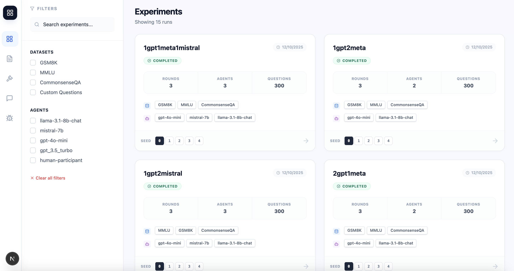

# Welcome to Introspecter

Introspecter provides tools to **simulate, debug, and analyze** multi-agent LLM debates. It orchestrates automated discussions on reasoning benchmarks like GSM8k and MMLU to observe consensus-building, while providing infrastructure for **counterfactual experimentation** where users can intervene in completed transcripts to test alternative outcomes.

In addition to automated simulation, Introspecter offers specialized environments for:

- **Argumentative Debate:** Pitting humans against citation-backed models in story-driven dilemmas.
- **Debate Annotation:** Visualizing completed debates alongside their citations and judge commentary.

### Get started

Check out our tutorials to learn how to use Introspecter:

- Start by [setting up Introspecter](./installation/local_setup.md)
- Then try running [running a basic debate](./tutorials/basic_debate.md)