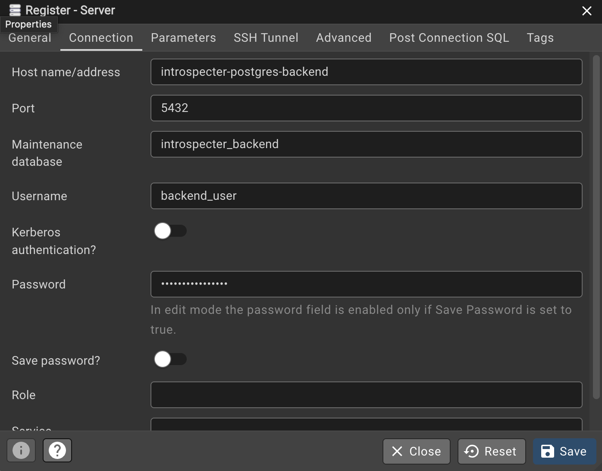
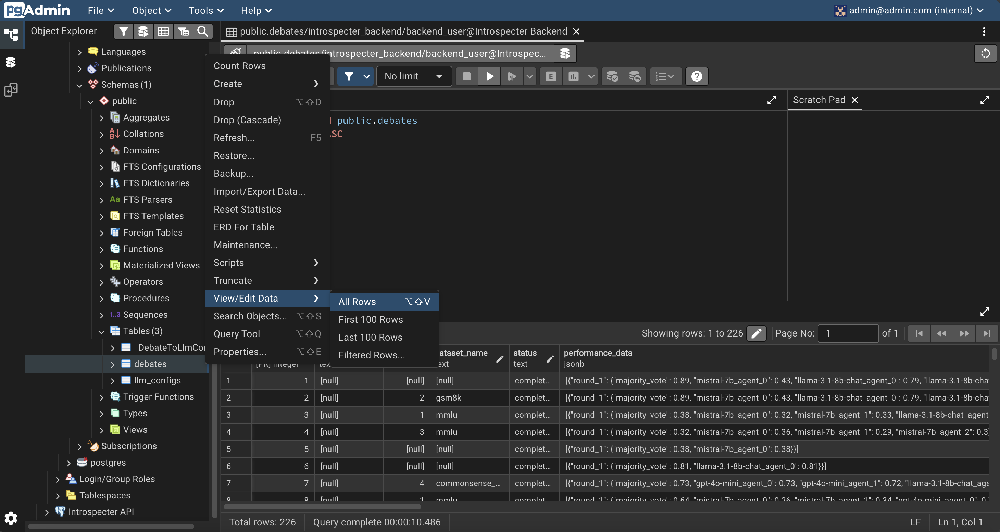

# Database Inspection (pgAdmin)

Introspecter uses **two distinct PostgreSQL databases**: one for the Python Backend (managed via Prisma) and one for the Next.js API (managed via raw SQL migrations). This guide walks you through using **pgAdmin** to inspect data, debug schema issues, and verify that experiments are saving correctly.

---

## Connecting to the Server

### Accessing pgAdmin

1. Open your browser and navigate to `http://localhost:5050`
2. Log in with the default credentials:
   <ul>
     <li><strong>Email:</strong> <code>admin@admin.com</code></li>
     <li><strong>Password:</strong> <code>admin</code></li>
   </ul>

### Adding the Server

1. Click **Add New Server**
2. In the **General** tab, give your server a name (e.g., `Introspecter API`)
3. Click the **Connection** tab and enter the following:

| Field                | Value                                                             |
|----------------------|-------------------------------------------------------------------|
| Host name/address    | `introspecter-postgres-api` or `introspecter-postgres-backend`     |
| Port                 | `5432`                                                             |
| Maintenance database | `introspecter_db` or `introspecter_backend`                        |
| Username             | `introspecter_user` or `backend_user`                              |
| Password             | `introspecter_pass` or `backend_password`                          |

Check your `.env` for the correct database name, username, and password, and your
Docker Compose file for the host name if you want to change the defaults above.

Once connected, you'll see your server appear in the browser tree with both databases listed underneath.

---

## Navigating to Tables

After adding your server, navigate to your tables using the browser tree:

**Navigation Path:**  
`Servers → [Your Server Name] → Databases →  [Database Name] → Schemas → public → Tables`

Double-click on any table, then select **View/Edit Data → All Rows** to inspect the data.

---

## Understanding the Two Databases

### Backend Database (`introspecter_backend`)

**Managed by:** Prisma  
**Purpose:** Stores LLM configurations and high-level experiment results

#### Key Tables

| Table | Purpose | Key Columns |
|-------|---------|-------------|
| `llm_configs` | Model parameters and API settings | `model_name`, `api_base`, `num_retries`, `temperature`, `max_tokens` |
| `debates` | Python-side experiment outcomes | `dataset_name`, `wandb_metadata`, `performance_data` |

---

### API Database (`introspecter_db`)

**Managed by:** SQL migrations  
**Purpose:** Tracks turn-by-turn debate execution
#### Key Tables

| Table | Purpose | Key Columns |
|-------|---------|-------------|
| `debates` | Master records for UI-initiated debates | `debate_type`, `celery_task_id`, `status` |
| `questions` | Question library for debates | `question_text`, `correct_answer`, `question_prompt` |
| `question_sessions` | Links questions to specific debates | `debate_id`, `question_id` |
| `rounds` | Individual debate rounds | `majority_vote`, `round_number` |
| `agent_responses` | Agent-generated text outputs | `response_text`, `is_human`, `extracted_answer`, `model_name` |

---

## Troubleshooting Tips

### Can't Connect to Database

- Verify Docker containers are running: `docker ps`
- Check that port `5432` isn't blocked or in use
- Confirm your `.env` database credentials match what you're entering

### Tables Are Empty

- Check that migrations have run: `docker-compose logs backend`
- Verify the correct database is selected in pgAdmin's tree view
- Look for errors in application logs

---

## Additional Resources

- [pgAdmin Documentation](https://www.pgadmin.org/docs/)
- [Prisma Schema Reference](https://www.prisma.io/docs/orm/prisma-schema/overview)